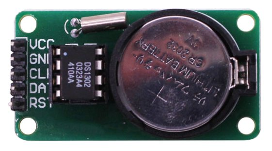

# Micorpython DS1302 RTC Clock driver
This is a pure Micropython DS1302 RTC Clock driver. This is based on microbit code of microbit-lib https://github.com/shaoziyang/microbit-lib

This has been tested and working on ESP32 but should work with any micropython supported device.

# Dirver documentation
(Adapted from https://github.com/shaoziyang/microbit-lib/blob/master/misc/DS1302/README.md)

DS1302 is real-time clock (RTC) with serial interface, 31 * 8 data ram.




## API
* **\_\_init\_\_(clk, dio, cs)**  
set i/o pins

* **start()**  
start RTC.  

* **stop()**  
stop/pause RTC

* **date_time(DT = None)**  
get / set DateTime. If no paramter given, it will return current datetime, otherwise it will set datatime.  
datatime format: [Year, month, day, weekday, hour, minute, second]

* **year(year = None)**  
get / set year.  

* **month(month = None)**  
get / set month.  

* **day(day = None)**  
get / set day.  

* **weekday(weekday = None)**  
get / set month.  

* **hour(hour = None)**  
get / set hour.  

* **minute(minute = None)**  
get / set minute.  

* **second(second = None)**  
get / set second.  

* **ram(reg, dat = None)**  
get / set ram data (31 bytes).  


## example

```
from machine import Pin
import ds1302

ds = ds1302.DS1302(Pin(5),Pin(18),Pin(19))

ds.date_time() # returns the current datetime.
ds.date_time([2018, 3, 9, 4, 23, 0, 1, 0]) # set datetime.

ds.hour() # returns hour.
ds.second(10) # set second to 10.
```
